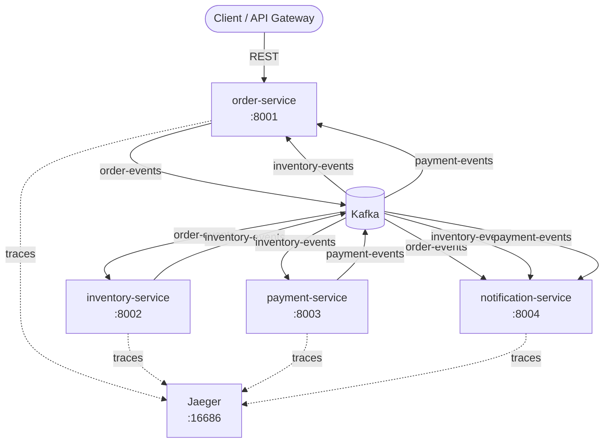
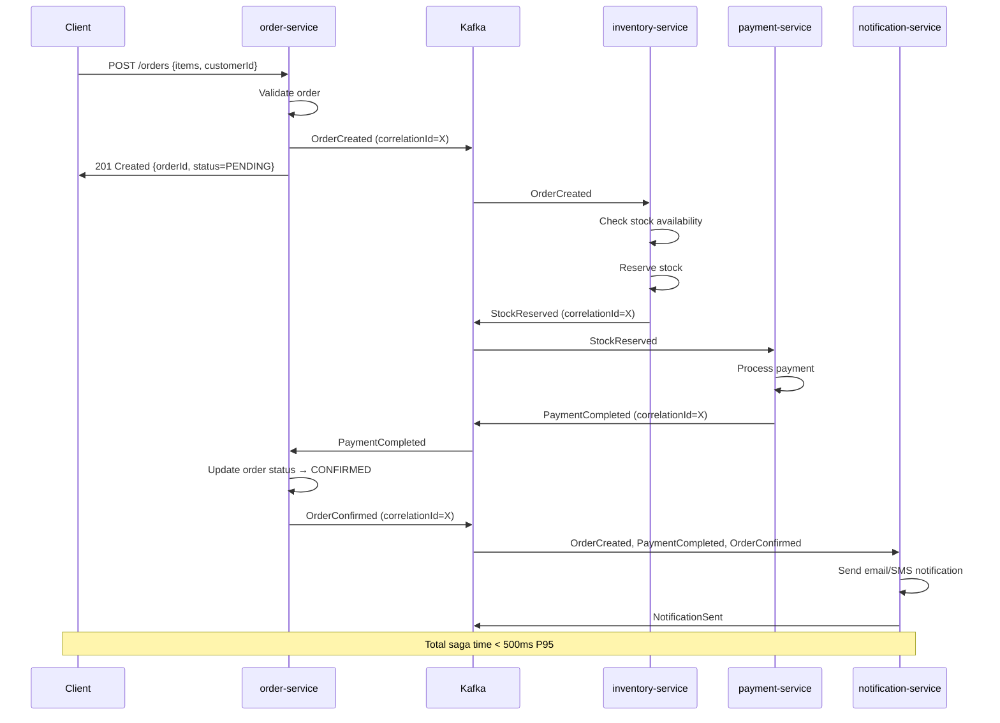
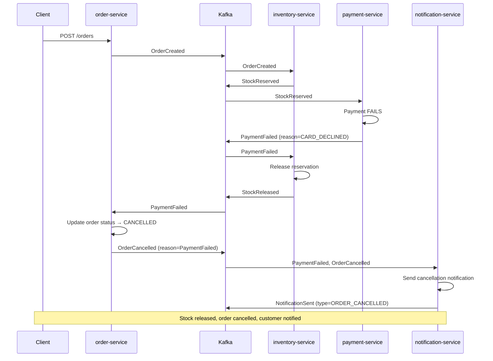
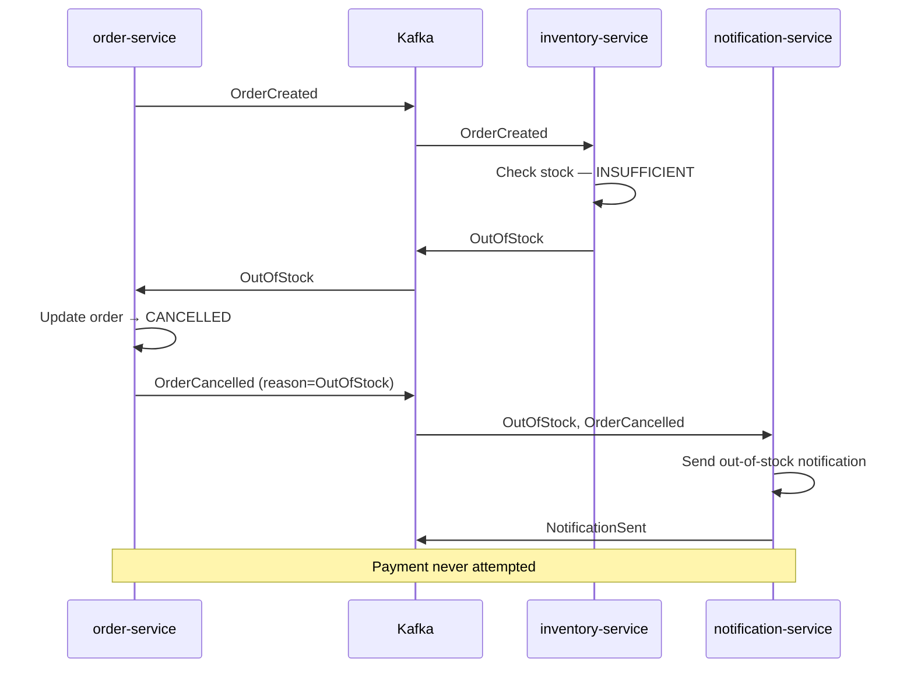

# Step 05c — Generate Service Dependency Map

**Output file:** `{output_folder}/{challenge_name}-dependencies.md`

Generate the complete service dependency documentation deliverable.

---

## Generate Document

Write the following to `{output_folder}/{challenge_name}-dependencies.md`:

```markdown
# Service Dependency Documentation

## Architecture Overview



---

## Service Catalog

| Service | Owner | Port | Dependencies | SLA | Scaling |
|---|---|---|---|---|---|
| order-service | Platform Team | 8001 | kafka, jaeger | 99.9% | Horizontal |
| inventory-service | Warehouse Team | 8002 | kafka, jaeger | 99.9% | Horizontal |
| payment-service | Payments Team | 8003 | kafka, jaeger | 99.95% | Horizontal |
| notification-service | Comms Team | 8004 | kafka, jaeger | 99.5% | Horizontal |
| kafka | Infra | 9092 | zookeeper | 99.99% | Cluster |
| jaeger | Observability | 16686 | none | 99% | Single node (dev) |

---

## Communication Matrix

| From → To | Protocol | Type | Topic/Endpoint | Guaranteed? |
|---|---|---|---|---|
| Client → order-service | HTTP/REST | Sync | POST /orders | Yes (HTTP 4xx/5xx) |
| Client → order-service | HTTP/REST | Sync | GET /orders/:id | Yes |
| order-service → Kafka | Kafka Produce | Async | order-events | At-least-once |
| inventory-service → Kafka | Kafka Produce | Async | inventory-events | At-least-once |
| payment-service → Kafka | Kafka Produce | Async | payment-events | At-least-once |
| notification-service → Kafka | Kafka Produce | Async | notification-events | At-least-once |
| Kafka → inventory-service | Kafka Consume | Async | order-events | At-least-once |
| Kafka → payment-service | Kafka Consume | Async | inventory-events | At-least-once |
| Kafka → order-service | Kafka Consume | Async | inventory-events, payment-events | At-least-once |
| Kafka → notification-service | Kafka Consume | Async | order-events, inventory-events, payment-events | At-least-once |

---

## Event Flow Diagrams

### Happy Path Saga



### Compensation Path — Payment Failure



### Compensation Path — Out of Stock



---

## Failure Scenarios

### Scenario 1: order-service Down

| Aspect | Impact | Recovery |
|---|---|---|
| New orders | Failed — client gets 503 | Restart service, client retries |
| In-flight sagas | Saga stalls after OrderCreated | On restart, order-service resumes consuming from last Kafka offset |
| Data loss | None — events persisted in Kafka | None |
| Dependent services | inventory/payment continue processing buffered events | No cascading failure |

### Scenario 2: inventory-service Down

| Aspect | Impact | Recovery |
|---|---|---|
| New orders | OrderCreated published but not consumed | Kafka buffers events |
| In-flight sagas | Stall at StockReserved step (no payment triggered) | On restart, consumer resumes from committed offset |
| Orders pending | All orders stay in PENDING status | Automatically processed on service recovery |
| Data loss | None | None |

### Scenario 3: payment-service Down

| Aspect | Impact | Recovery |
|---|---|---|
| New orders | Stall at PaymentCompleted step | Kafka buffers StockReserved events |
| Stock impact | Stock reserved but not released | Released on PaymentFailed or service recovery |
| Timeout risk | If down too long, stock stays reserved | Implement reservation TTL in production |
| Recovery | On restart, processes all buffered StockReserved events | Idempotency prevents double charges |

### Scenario 4: notification-service Down

| Aspect | Impact | Recovery |
|---|---|---|
| Business flow | Order saga completes normally | Notifications are non-blocking |
| Customer impact | No email/SMS notifications sent | Kafka buffers all events |
| Recovery | On restart, sends all buffered notifications in order | May send delayed notifications |
| Data loss | None | None — Kafka retention holds events |

### Scenario 5: Kafka Down

| Aspect | Impact | Recovery |
|---|---|---|
| All services | Cannot publish or consume events | All sagas stall |
| New orders | POST /orders fails (cannot publish) | Client receives 503 |
| Recovery | Restore Kafka from cluster backup | Services auto-reconnect and resume |
| Prevention | Use Kafka cluster (3 brokers) in production | Single point of failure eliminated |

---

## Runbook

### Starting the Full Stack

```bash
# Clone repository
git clone <repo-url>
cd microservices

# Start all services
docker compose up --build

# Verify all services healthy
curl http://localhost:8001/health  # order-service
curl http://localhost:8002/health  # inventory-service
curl http://localhost:8003/health  # payment-service
curl http://localhost:8004/health  # notification-service

# Open Jaeger UI
open http://localhost:16686
```

### Testing the Happy Path

```bash
# Place an order
curl -X POST http://localhost:8001/orders \
  -H "Content-Type: application/json" \
  -d '{
    "customerId": "CUST-001",
    "items": [{"productId": "PROD-001", "quantity": 1, "price": 29.99}]
  }'

# Check order status (use orderId from response)
curl http://localhost:8001/orders/{orderId}
# Expected: status=CONFIRMED within 5 seconds

# View trace in Jaeger
open http://localhost:16686
# Search: service=order-service, operation=POST /orders
```

### Replaying Events from Dead Letter Queue

```bash
# List events in DLQ
kafka-console-consumer.sh \
  --bootstrap-server localhost:9092 \
  --topic order-events.dlq \
  --from-beginning \
  --max-messages 10

# Replay DLQ events to main topic (after fixing the bug)
kafka-console-consumer.sh \
  --bootstrap-server localhost:9092 \
  --topic order-events.dlq \
  --from-beginning | \
kafka-console-producer.sh \
  --bootstrap-server localhost:9092 \
  --topic order-events
```

### Resetting a Consumer Group (Event Replay)

```bash
# Stop the service first, then reset offset
kafka-consumer-groups.sh \
  --bootstrap-server localhost:9092 \
  --group inventory-order-consumer \
  --topic order-events \
  --reset-offsets --to-earliest \
  --execute

# Restart the service — it will reprocess all events
docker compose restart inventory-service
```

### Checking Consumer Group Lag

```bash
kafka-consumer-groups.sh \
  --bootstrap-server localhost:9092 \
  --describe \
  --group inventory-order-consumer
```

### Scaling a Service

```bash
# Scale payment-service to 3 replicas
docker compose up --scale payment-service=3

# Note: Kafka partitions must be >= replica count for parallelism
# Current partition count: 3 per topic (supports up to 3 replicas per consumer group)
```

### Stopping the Stack

```bash
docker compose down          # Stop and remove containers
docker compose down -v       # Also remove Kafka volumes (reset all data)
```
```
